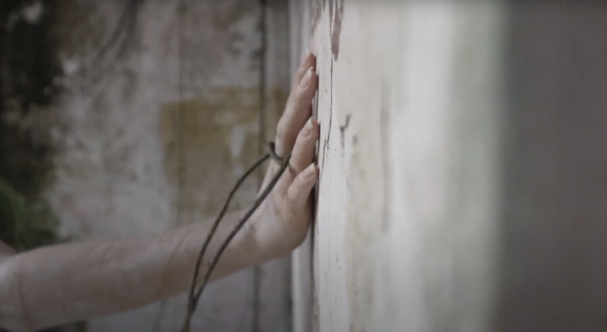

“Ando de um lado para outro, dentro de mim. Estou bastante acostumada a estar só, mesmo junto dos outros” (Clarice Lispector)
Penso que não posso viver sem o outro, mas ao mesmo tempo o universo que crio de uma perspectiva do mundo, é só meu. A arte e o amor são elos, lampejos que tornam possível uma conexão, uma intersecção de mundos. 
Para abrir espaços, portas, são necessárias fissuras.

Faixa 3: Lado a Lado.
Videoclipe dirigido por @juvasconcelossecretions  

Ficha Técnica:
Música: Felipe Romagna
Masterização: Crossfade 
Criação e Produção: Felipe Romagna e JuVasconcelos
Video Performance: JuVasconcelos 
Video: Aryane Almeida 
Styling: Vinny Araújo 
Fotografia Still: Tereza Maciel
Apoio Cultural: Piratas da Ilha
Agradecimentos: Geraldo e Francisca Vasconcelos

### *English*
“I walk from side to side, inside me. I am quite used to being alone, even together with others ”(Clarice Lispector)
I can't live without the other, but at the same time, the universe that I create from a perspective of the world is mine alone. Art and love are links, flashes that make possible a connection, an intersection of worlds.
To open spaces, doors, cracks are necessary.

<iframe width="640" height="360" src="https://www.youtube.com/embed/FYgQYogEMrA?si=nQ7uACv-Z5s9lNJt" title="YouTube video player" frameborder="0" allow="accelerometer; autoplay; clipboard-write; encrypted-media; gyroscope; picture-in-picture; web-share" referrerpolicy="strict-origin-when-cross-origin" allowfullscreen></iframe>

