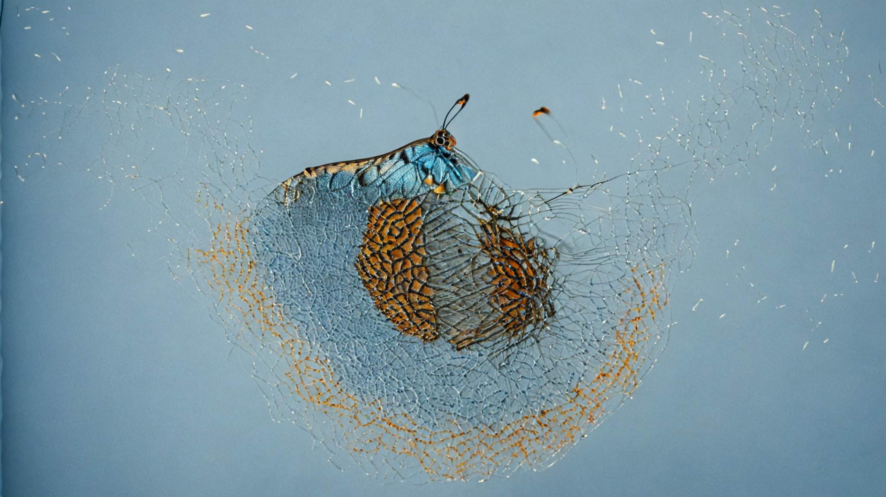

Este trabalho é resultado de um estudo que envolvia programação em Python na música. Inspirado pelo professor Dr. Rogério Vasconcellos, iniciei alguns experimentos utilizando uma ferramenta livre de IA generativa chamada ComfyUI ([workflows aqui](https://github.com/feliperomagna/ocelo)). Minha ideia foi criar uma peça audiovisual que abordasse as transformações da vida de uma borboleta. Minha principal busca foi criar um ambiente visual e sonoro imersivo, com sons filtrados e uma visão microscópica. 

Efetuei uma apresentação a respeito do processo criativo no congresso *Convergence* em Antwerp na Bélgica em 2024, o resumo está disponível [aqui](https://www.researchgate.net/publication/389851281_Co-Creating_with_AI_Artistic_processes_in_Ocelo_Modulations_of_a_Butterfly_2024).

### *English*
This work is the result of a study involving Python programming in music. Inspired by professor Dr. Rogério Vasconcellos, I began some experiments using a free generative AI tool called ComfyUI ([workflows here](https://github.com/feliperomagna/ocelo)). My idea was to create an audiovisual piece that would address the transformations in a butterfly's life. My main pursuit was to create an immersive visual and sound environment, with filtered sounds and a microscopic view.

I gave a presentation regarding the creative process at the Convergence conference in Antwerp, Belgium in 2024; the abstract is available [here](https://www.researchgate.net/publication/389851281_Co-Creating_with_AI_Artistic_processes_in_Ocelo_Modulations_of_a_Butterfly_2024).

<iframe width="640" height="360" src="https://www.youtube.com/embed/b0FYBtTViUg?si=beA1vlOwArn3Cgq1" title="YouTube video player" frameborder="0" allow="accelerometer; autoplay; clipboard-write; encrypted-media; gyroscope; picture-in-picture; web-share" referrerpolicy="strict-origin-when-cross-origin" allowfullscreen></iframe>

