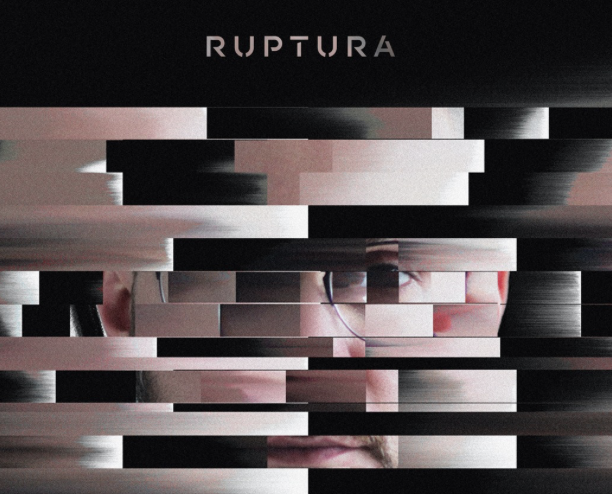

Em 2020, durante a pandemia, produzi um álbum com sintetizadores que representou uma mudança de trajetória pessoal na minha produção artística. Ele está disponível no BandCamp. 

<iframe style="border: 0; width: 350px; height: 588px;" src="https://bandcamp.com/EmbeddedPlayer/album=4100922582/size=large/bgcol=333333/linkcol=ffffff/transparent=true/" seamless><a href="https://feliperomagna.bandcamp.com/album/ruptura">Ruptura by Felipe Romagna</a></iframe>

